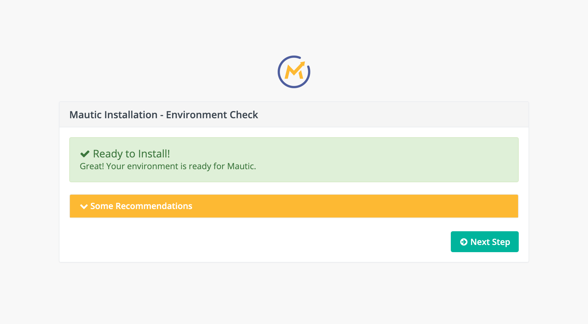
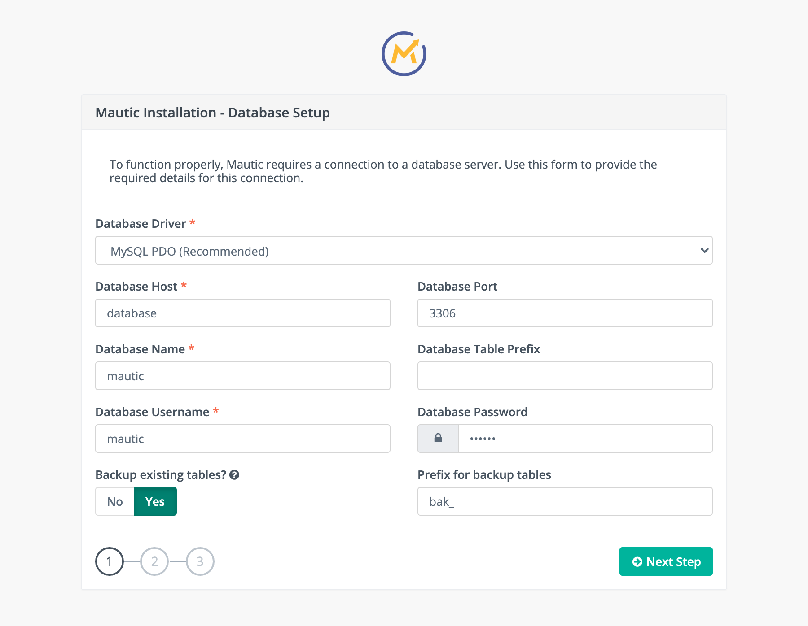
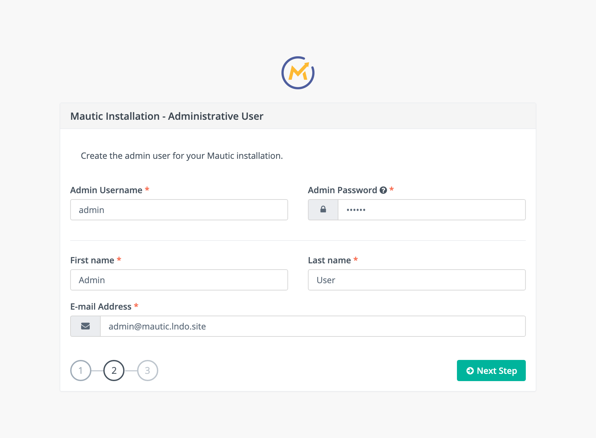
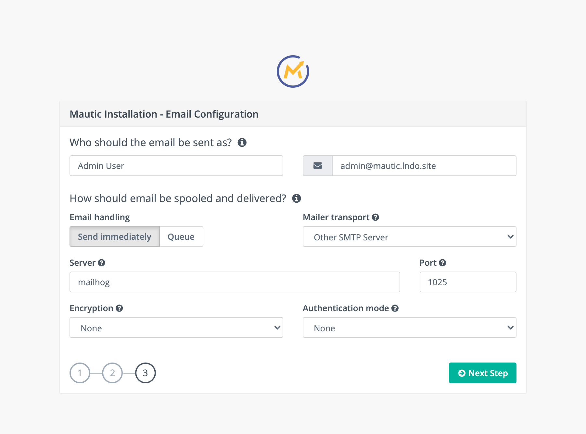
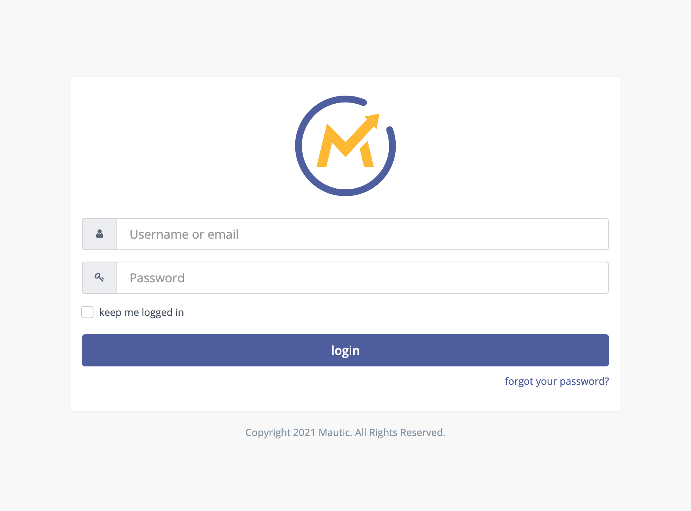

**The Requirements**

You the following two things to setup your Mautic instance
* lando https://docs.lando.dev/
* composer https://getcomposer.org/


**First of all you need to install Mautic via Composer**

````
composer create-project mautic/core YOURPROJECTNAME ^3 --no-dev
```
You need to replace "YOURPROJECTNAME" with the name of the projects folder.

**Step Two - Lando**

Config

Create **.lando.yml **with the following content:

```
name: mautic
recipe: lamp
config:
  webroot: .
  php: '7.3'
  database: mysql:5.7
tooling:
  mt:
    service: appserver
    description: Run Mautic commands
    cmd: bin/console
proxy:
  mailhog:
    - mail.mautic.lndo.site
services:
  appserver:
    type: php
    build_as_root:
      - docker-php-ext-install sockets
    xdebug: true
    config:
      php: .lando/php/php.ini
  database:
    type: mysql:5.7
    portforward: true
    creds:
      user: mautic
      password: mautic
      database: mautic
  mailhog:
    type: mailhog
    portforward: true
````
**Build containers**
```
Lando Start
```
This will create the needed docker containers (can take a while).
Once the containers are up and running we can access
https://mautic.lndo.site/

**Let’s setup Mautic**
Let’s open https://mautic.lndo.site/
You should see now the following screen:


**Step 1**
Set Database settings to use the following:

Database: mautic,
Password: mautic,
Username: mautic
Host: database,
Port: 3306


**Step 2**
Setup your admin user:
Username: admin
Password: SETYOURPASSWORD
Name: Your name
Last name: Your last name


**Step 3**
We set to use the mailserver to be the mailhog docker container:
Server: mailhog,
Port: 1025
And we can access Mailhog via
http://mail.mautic.lndo.site/


**Login**
You can now login to your freshly installed Mautic setup with the credentials from the previous step.
