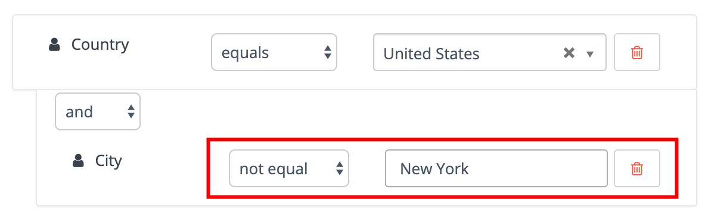

## What are Segments?

To start it off nice and simple let’s cover the basic function of Segments. In Mautic, Segments are used to easily organize contacts by grouping them using a variety of different filters and conditions. They are used to send out emails, trigger campaigns, or simply for analysis.

As they also are one of the contact-sources used in Campaigns, so you can think of them as the backbones of an organized and manageable Mautic instance.

## How to set up Segments

Segments are to be found in the main menu under the category of “Segments”. Simply click it and there you’ll find a list of all of your segments. You can also see how many contacts are in each segment. To create a new one, click “+ New”.

In the ‘Details’ menu of the segment builder, you can name your segment, enter an alias and add a more specific description of the Segment. You can also choose the following option:

**Public Segment:** This option determines if the segment is available for all users (users are folks with backend access to your Mautic instance) to see and use, or only the user who created the segment.

**Available in Preference Center:** If set to Yes, contacts will be able to see and opt into or out of the segment on a Preference Center page. The segments will only appear if the Preference Center contains the Segment List slot type.

**Published:** If set to no, the segment will not be available for use in filters for other segments, as a contact source in campaigns, in modify segment actions, and so forth. While you will still see the segment in your segment list, it essentially won’t exist anywhere else in Mautic.

Now, as your Segment is given a name, you need to click on “Filters” next to Details. The ‘Filters’ menu is where you select the characteristics that define your segment using the drop-down menu. Mautic offers a huge repertoire of available filters to use. To customize your segment, first choose the filter that applies to your desired segment. 

**To have a good example**, let’s filter for contacts living in the United States, but exclude people living in New York. To do that just choose the filter “Country” in the dropdown menu. 	

Now you can specify the conditions for your country filter. You have two options to specify, the operator field and the field to choose the specific country. In the operator field you can determine the relationship your Contact has with that contact property.

In other words, your Segment can include and exclude Contacts. As we want to include people coming from the United States we choose the operator “**Equals**” and in the Country dropdown determine “**United States**” as the country we want to include our contacts from.

Last but not least we now want to exclude people coming from the city of New York. To do that just add a second filter that filters for “City”. 

You now have to choose between the “and / or” statement. If you choose “**and**” you can determine a second condition which is based on your first filter, if you choose “or” you get a independent new filter. We choose “and” as we want to build another condition based on the first country filter.

Finally, choose the operator “not equal” and the city of New York to exclude everybody coming from New York. 

If you are interested in learning more about Segments in Mautic, here is a list of more advanced techniques used in Segments for you:

Dynamic vs. Static 
Matching part of a string
Date Options
