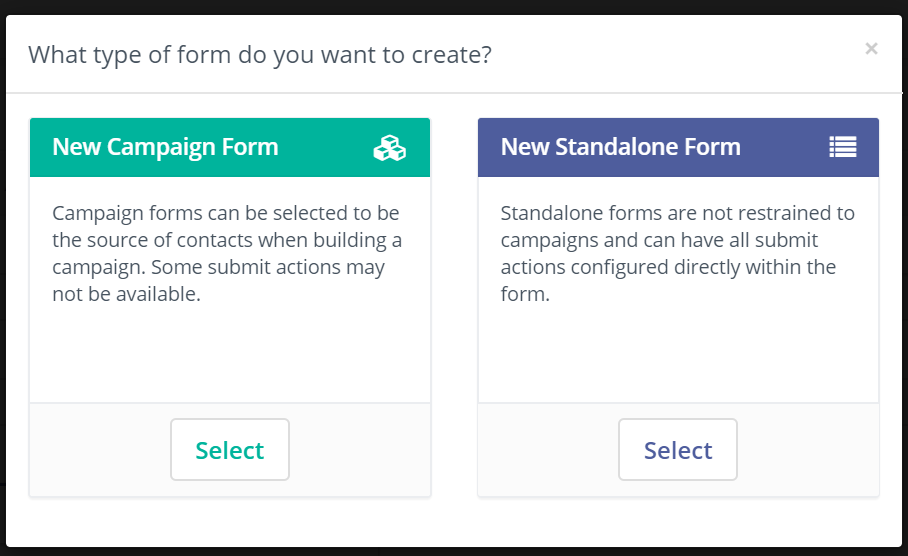
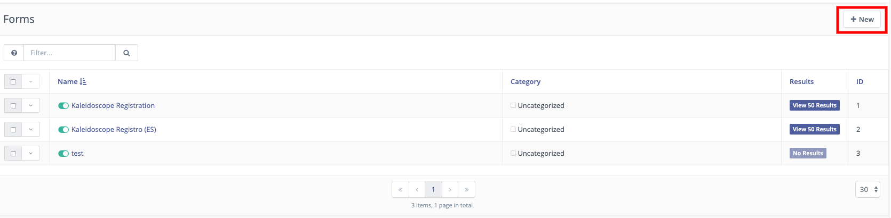
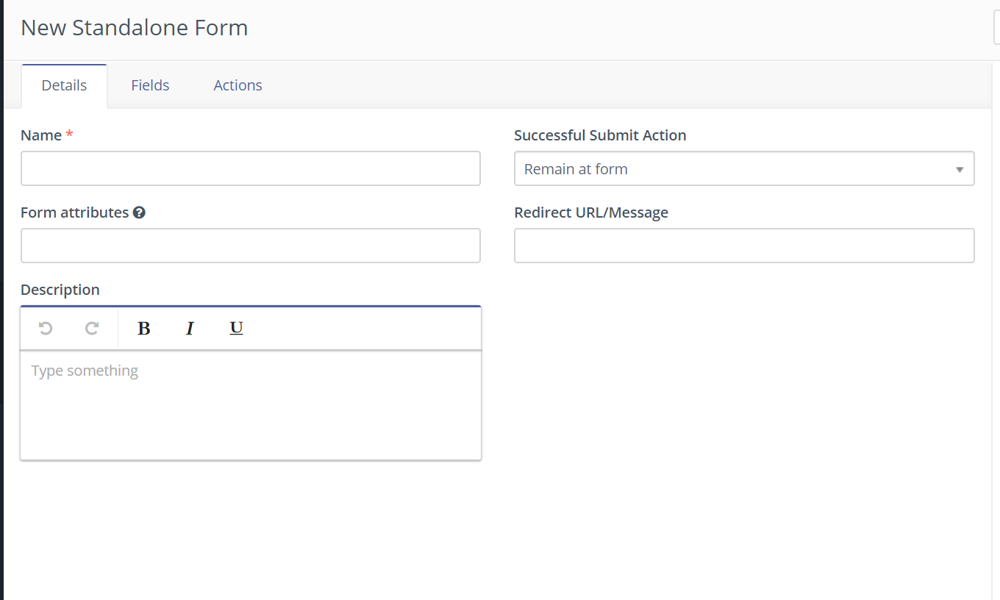
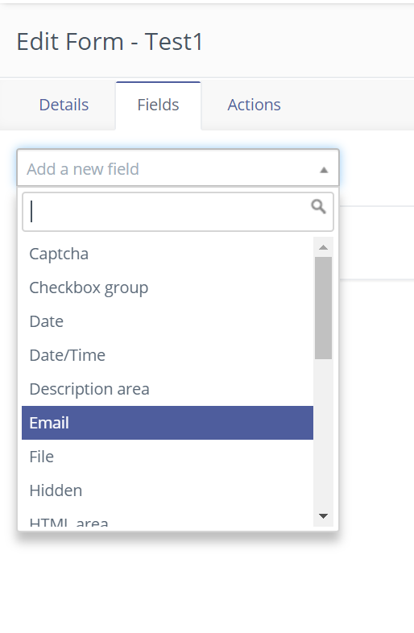

# Working with forms

Forms are one of Mautic's most important features, as they are used to collect user information and to identify them throughout the use of a cookie that is set on form submit.

Forms are often used in conjunction with another core feature of Mautic -  landing pages - which are HTML pages where forms are published. (link to landing pages here)

As most of our contacts or leads will be collected by this means, it is crucial for every marketer to fully understand form functionality and behaviour. 

Typically, you'll use marketing forms as part of your lead generation and scoring strategy. Leads fill forms in because they expect to receive in exchange a reward: something of enough value to encourage them to share their personal information with you. 

The reward could be anything from a discount voucher to a whitepaper, a catalogue, a request for proposal, some technical details of a product or even a newsletter subscription…   any of those could be relevant pieces of information for your leads.

Ensuring that the resource you offer is relevant to the lead at their point in the customer journey will help to ensure that you receive a good volume of submissions.

“Many organisations will request contact information prior to sharing pricing information, which is a way of getting to know who the lead is when they are at a critical point in the buying cycle.”

It is important to think carefully about how many - and which - fields you add on a form. Too many fields, or questions which create friction for the visitor, may result in less form completions.

As a general guideline, try to avoid asking for information, which is not directly required to deal with the inquiry (eg. mobile, VAT, social security numbers, etc.), as this could reduce the volume of submissions you receive and may have legal implications regarding the GDPR regulations and other similar legislation. Also, consider carefully which fields are mandatory.  A form that has a mobile number as mandatory may receive poor results unless the “reward” is extremely appealing for the lead.

It is good practice to use progressive profiling (https://docs.mautic.org/en/components/forms/progressive-profiling#progressive-profiling) in order to collect all the information you need from your leads over time, when appropriate to ask for the information, instead of asking for everything in one large form.
## Types of forms in Mautic

Mautic has two different kinds of forms: Campaign forms and Standalone forms.

They are very similar and which one you should use depends on whether you need to associate it to a Mautic Campaign(link) or not. 

Campaign forms, as the name indicates, can be associated with a Campaign Start element so that all the leads that fill in the form will be funneled directly into a campaign. As a result of this behaviour, some form actions (events that can be triggered at the moment of submitting the form) are not available in the actions tab (as you can achieve them by using Campaign events).

On the other hand, Standalone forms are independent of any campaign and thus all the Actions events are available.

“It is important to state that Form actions are among the few events in Mautic that are executed in real time, meaning at the time the lead clicks on the submit button, as opposed to cron executed events that need to wait for the system to launch them on predefined intervals. (link to cronjobs)" 

## Setting up a form
Once you decide the type of form you want to create, navigate to forms (which can be found under the Components section, and click on +New. 

Let’s add a screenshot here.

The following dialog will be displayed:

As you can see there are three tabs you have to configure in order to get your form up and running. Let’s get into Details first.
### Form Details
As in any other Mautic element, you have to give a name to your form. Try to be descriptive as experience teaches us that form1, form2, and so on, tend to be very confusing in the long term.

The same applies to the Description field. Use it to describe in detail where the form will be published, which fields it is collecting, which campaign it is attached to (in case of campaign forms), which actions it performs on submit, etc. All of it will help you and your teammates to quickly identify which is the form they are looking for.

“it’ is a good practice to set up some kind of internal taxonomy to identify each form, especially if you think you are going to create a large number of them or if different people are going to work collaboratively on the same Mautic instance”

Once you identified your form you are asked to define what it will do after a “Successful Submit Action” meaning what will happen after the lead clicks on the submit button.

There are three different options:
Remain at form: Submits the form and the user remains at the form
Redirect URL: sends the lead to a new page (URL) that you have to specify. This option is especially suited for marketing campaigns that track objectives throughout the use of tracking pixels or conversion detection, such as paid advertising campaigns on search engines and social media sites. The conversion code/pixel resides on the landing page you defined which is invoked exclusively when an objective (form submission) is accomplished, thus being tracked in the advertising tool dashboard as a conversion.
Display message: Shows the message you write into the field. This gives positive feedback to the user about the form submission.

### Form Fields
The fields section is where you have to define what data will be collected by the form, which we begin by specifying the type of field. 

“It is important to note that you may associate the form fields to database fields (given that its dataset is compatible). Moreover, it is possible to associate data from forms with contact, customer  or with custom fields”

There are different types of fields: fields to collect data and fields used to improve the user experience or to prevent spam - such as using hidden fields as a way to detect automated form completions.

The following is the complete list of all the available field types when creating a form in Mautic.

* Checkbox group 
* Date
* Date/Time
* Email
* File
* Hidden
* List - Country
* Number
* Password
* Phone
* Radio group
* Select
* Social login
* Text
* Textarea
* URL

And these are the auxiliary fields

* Page break - allows you to split forms into sections (eg. personal information, address and so forth) using pagination
* Description area and HTML area: used to add information or instructions to the form to help the lead understand the form

Once you have selected a form field you need to configure it using the edit dialogue that has five tabs:

**General**
Here you have to assign a label to the field which is the only mandatory field. Then you may decide if you want to show the label, or if you prefer there is an option to have an input placeholder for the field. You can also configure the default value of the field (if any), and a help message which would appear below the label. Finally, you have to decide if you want to save the value of the field into the database or not. 

In case you choose yes then the value will be saved into the form result table only.  If you choose no, the value will not be saved. In the next step, we will see how you can associate the field with existing fields in Mautic - for example filling a contact’s address information on their lead profile from the form submission

**Contact field**
In this tab you can choose the database field where you want to save the value. This could be a contact field or a company field, but you must have created the field before you can select it in your form. You may choose from the default fields or create new custom fields.

“The email field, as it is the database key field, will always be associated by default with the email field in the database.“

**Validation**
This tab value indicates if you want the field to be mandatory or not, and allows you to determine any validation that might need to be carried out to ensure that the information submitted on the form is in the format you expect to receive. You can provide a validation message which explains what the problem is if the validation fails. Mandatory fields will be represented by a red asterisk by default in the front end unless your styling overrides this.

**Attributes**
In this section you can provide attributes for the field, which can be used to style the field when it is displayed in the front-end. In case you are using a form template you may declare individual field attributes using Id, classes or inline CSS style in order to modify the look & feel of each field separately.

Attributes that you can define include: 
* Field HTML name
* Label attributes
* Input attributes
* Field container attributes

**Behaviour**
In this section you can determine what should happen to the field if the data is already existing for a known lead, and whether to show the field after a specified number of submissions. 

The options Show when value and Auto fill data exists refers to Mautic’s ability to hide a certain field or to show it pre filled if the value is already known. 

## Form actions
Actions are events that are triggered immediately after the form is submitted. These actions do not need to wait for the cronjob to be executed, thus sometimes are preferred to campaign actions - especially when the timing is important. 

There are actions available which modify  contact or company values:
* Adjust company score
* Adjust contact points
* Modify contact segments
* Modify contact tags
* Record UTM Tags
* Remove contact from do not contact list

While most of these actions are quite self explanatory, we should draw attention to the final action.  This is an important action because we are effectively removing an existing directive to not contact the lead through this channel.  

On the other hand, there are actions that trigger other actions:
* Download an asset
* Post results to another form
* Push contact to integration
* Send email to contact
* Send email to user
* Send form results

Most of them are quite understandable. 

Post results to another form allow you to synchronize external systems with Mautic forms. Push to integration allows you to push the form information into another system (it does require you to have the integration plugin configured in order to be available for selection). 

Send email to contact is what is normally known as an autoresponder - sending an email to the person who completed the form, usually thanking them for the submission or providing confirmation that their message has been received.

Send email to user allows you to alert a Mautic user by sending them an email notification on form submission.

Send form results will send a preformatted email which includes all the form values submitted in the form, which can be sent to one or more specified email addresses.
## Form results

As we have seen above, we can save form data into the contact/company fields, but each form also has its own table in the database where all the fields marked with Yes in the Save result option are retained.

To access the results table, you have to click on the results tab in the form list view.

In this view you’ll find some useful pieces of information that aren’t available in any other part of Mautic. 

You’ll find among all the form field data the timestamp and IP address where the form submission originated from. Also, you may export this data in CSV, Excel or HTML formats for the purpose of analysis or backup. 
