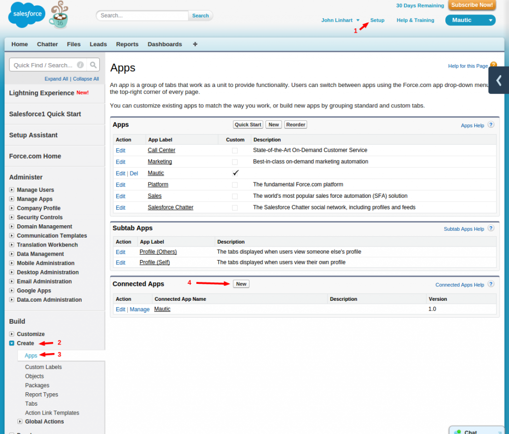
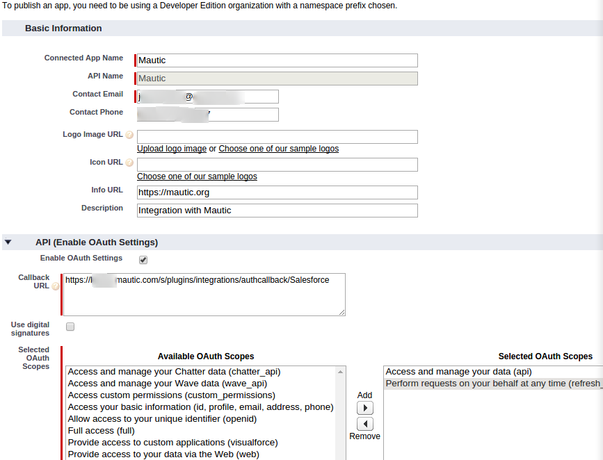
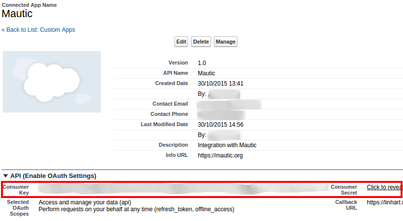
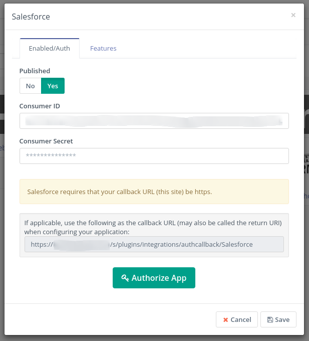
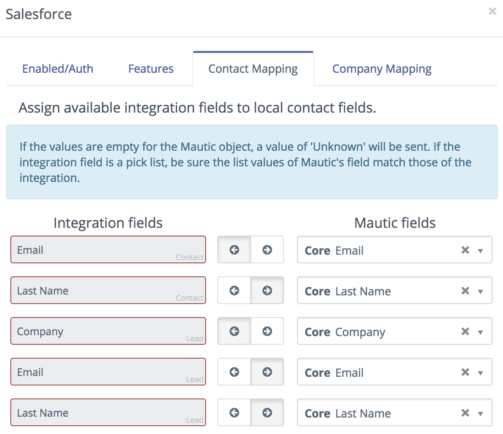
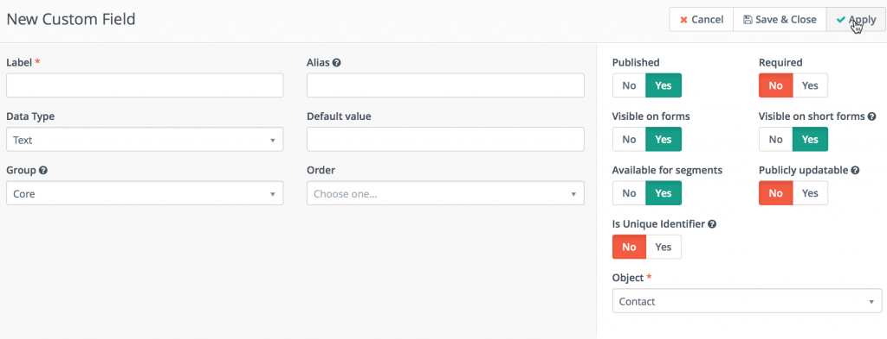
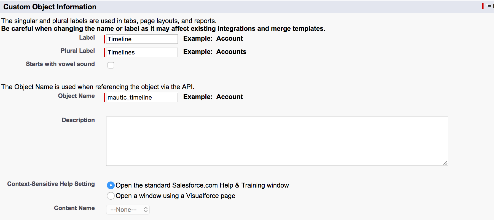
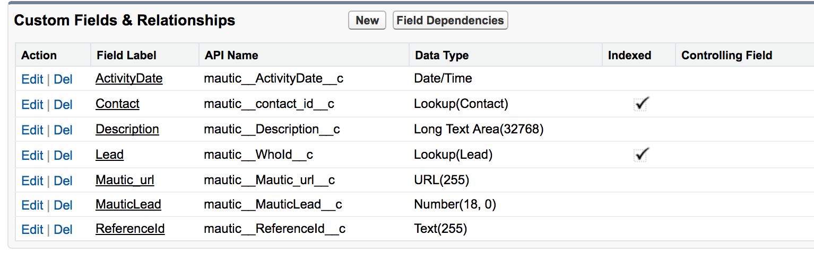

# Mautic - Salesforce Integration

This article describes how to set up the integration between Salesforce and Mautic, including how to configure the integration to pass **Mautic Activities into SalesForce** and some **Recommendations & Best Practices**. This integration leverages the REST API and the only Salesforce editions that enable APIs are:
* Enterprise Edition
* Unlimited Edition
* Developer Edition
* Performance Edition

If your Salesforce account is not one of the above, please contact Mautic support or your Salesforce rep to learn about upgrade options.
If you have one of the Salesforce Editions listed above, please follow the steps below to enable the plugin

## Steps on how to enable the Mautic Salesforce plugin
1. Get the Salesforce credentials

Here is the [official documentation] [official documentation] about how to get the key and secret.

* Go to: Setup (top right corner) / Build (bottom left corner) – Create / Apps / Connected Apps / New

*  Create a new app to look like this:

Make sure the Selected OAuth Scopes are Access and manage your data (API) and Perform requests on your behalf at any time (refresh_token, offline_access).
* Copy the Consumer Key and Secret.

2. Configure the Mautic Salesforce plugin

* Insert the keys to the Mautic Salesforce plugin and authorize it.

*  Configure the field mapping.  All the required fields in the SalesForce Contact Object and Lead Object should map to Mautic Core Email, Last Name and Company Fields, as shown below:

*  Any custom lead fields in Salesforce must be created in Mautic as custom fields in the contact object.

#### Features Tab within the plugin
* Enabled features: You can pull leads and/or push leads to and from the integration.
* Triggered action push to integration: This can only be done through a form or a campaign.
* Pull leads: This can is done via API.
* Push contacts to this integration: This is done through API sync that takes place every 8-10 minutes.
* Feature specific settings: Select the objects you wish to pull or push records from. You can push contacts to the Leads object in salesforce. You can also push activities (contact’s timeline records) to a custom object in salesforce
* Pulling records: Will be done from Leads and/or Contacts objects in Salesforce.

#### Setting up Mautic’s Activities in Salesforce
You have two options with the Salesforce integration to push Mautic activities into Salesforce. One option is to pass the activities into a custom object that allows the activities to be reportable. The other way is to set up a custom URL field in Salesforce and then Mautic will insert a contact’s timeline link.

**Option 1:** Make activities reportable – you first need to set up a custom object in your Salesforce instance. Please set up the object as it is described below

**Step 1:** On the initial screen of creating a custom object, make sure the Label field is populated with the value `Timeline` and the Object Name is `mautic_timeline`. This will auto-populate a few fields and then you have the option to populate other fields that haven’t pre-populated with values that relate to your business or this object. These additional fields do not impact the activities.

**Step 2:** When you save this initial screen, you will be taken to the custom objects screen where you can set up the custom fields. Create the 7 custom fields that match the below format exactly:
* ActivityDate: Date/Time
* contact_id : Lookup(Contact)
* Description : Long Text Area(131072)
* WhoId : Lookup(Lead)
* MauticLead : Number(18, 0) (External ID)
* Mautic_url : URL(255)
* ReferenceId : Text(255)

This is the only one that needs to be set up as a unique – select `do not allow duplicate values` in Salesforce (API names for these will be auto populated)

**Step 3:** When enabling the activity object, you need to tick the Activity checkbox in the Mautic plugin configuration and also specify the namespace prefix if it's available in Salesforce.

**Step 4:** On the Mautic side, make sure `Activity` is checked in the Features tab of the Salesforce plugin.

**Step 5 (repeat for both leads and contacts):** Edit the layout, and scroll to the related list for the Mautic timeline. Click the wrench to edit, and select Activity Date from Available Fields and add it to the Selected Fields. Save the layout.

_For more help with editing related lists in Salesforce, visit the [Salesforce help center][Salesforce help center]_

**Step 6:** Unpublish your plugin then re-publish. Save and close

Once you re-publish the plugin, Mautic will look at all of your contacts from the** last 7 days** then update those corresponding contacts or leads in Salesforce with the correct activities. The activity sync API takes about 8-10 minutes to push activities over from Mautic to Salesforce.

**Option 2:** Contact’s timeline link – you need to create a custom URL field within Salesforce. On the Mautic plugin page, go to the `Contact Mapping` tab and search for the newly created URL field in the list of Salesforce fields. Map this field to the Mautic, `Contact’s timeline link` field. This will display a link in Salesforce that, when clicked on, will open a new window, displaying all activities related to the contact. This is the same view that you have within Mautic’s timeline history on individual contact records. 

**Note** – these items will not be reportable within Salesforce.

Since you’ll need to determine the direction of the update, within the mapping, choose the arrow that points from Mautic to Salesforce.
In order for your sales reps to click on the link and view the contact’s history, they will need to be set up as users within Mautic.

#### Test the plugin

If you want to test an integration plugin to ensure that it is configured properly, you have 3 options on how to do that. A contact can be pushed to integration via these places:

* The Campaign Builder has the _Push contact to integration action _ which can be used in the Campaign drip flow.
* The Standalone Form has the_ Push contact to integration action _ which can be used after a standalone form is submitted.
* The Point Trigger has the _Push contact to integration action_ which can be triggered when a contact achieves some point limit.

Use any of those triggers to test the plugin and see if the contact appears in the integration.

#### Recommendations and Best Practices
* Mautic does not display the Salesforce contact or lead ID in the UI. The best practice is to create a custom field for the Salesforce ID within Mautic and map it to the Salesforce ID under `contact mapping` in the plugin. This will allow you to build reports that include contacts with a Salesforce ID within Mautic.
* Test the plugin by only turning on the `Triggered action push contacts to integration` because this will safely allow you to test the mapping of your custom field with a select number of contacts.
* In order to test, create a test segment and a test campaign with an action to `Push contacts to Integration`, so you can make sure the fields mapped appropriately.
* If setting up a Select list custom field in Mautic, we recommend matching the values in Mautic that you have in your Salesforce picklist. If you choose to not match the lists then Mautic can push values into Salesforce picklists only when the picklist custom field in Salesforce is set as unrestricted. Mautic’s select fields, by default, are unrestricted.
* Within the Features tab, in order to pull contacts in from `Activity`, you need to have a namespace prefix entered. This field is right below the Activity field on the Features tab.
* Salesforce requires values on certain fields being passed in, such as Last Name and Company Name. If Mautic has those fields set as blank then Mautic will push the value, `Unknown` into Salesforce. If you have the `Pull contacts from integration` turned on to pull those fields into Mautic then Mautic will not populate those fields with Unknown. They will be left blank.
* If you use Salesforce campaigns, you can set up a segment to pull in members of a specific Salesforce campaign
 * Create a new segment then use a filter for `Integration Campaign Members` then select the campaign you’d like to use

 [official documentation]: <https://feedback.uservoice.com/>
 [Salesforce help center]: <https://help.salesforce.com/articleView?id=customizing_related_lists.htm&type=5>

.

