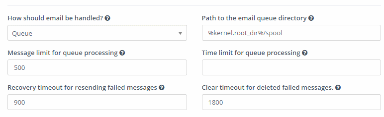
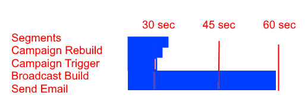
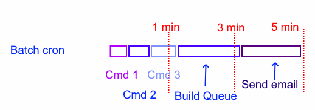

There are different ways how to handle SES with Mautic, I will share you my practice, which I use for all our customers at Friendly Automate 2 and which works like a Swiss clockwork. There are other good solutions as well, I’m sure someone will post their in this thread. (Always use the proper path, since I’m not paying attention to it in this guide)

**Too fast sending**
If you send too fast, your campaign will fall into a cliff. That means you start sending, depending on the speed first 500-1000 emails are delivered, and the rest just goes into Valhalla, as won’t be deleviered nor will you get a message from Mautic, that something is wrong. You’ll see these messages with delivered status in Mautic, never received status in Amazon SES, and there is no way to know what got sent out and what didn’t. (At leas no easy way.)

I address this the following way:

###1. Queue is your friend

As I’m sending thousands of emails, I’m using the queue. You need to turn it on in the Mautic settings.
Configuration > Email Settings > Queue processing

You can use the above settings, we will overwrite them anyway in the crontab. (See later)

When you create an email, and send it out in your browser, you’ll see a line while the send is completed.

If you don’t set the queue processing, than your emails will be sent out right there on the fly by your browser basically. It is a good way to send out lists like this if you like to play with fire. You’ll run into php timout, amazon SES limit ban, etc.

If you have queue processing allowed, the progress bar will represent the emails pushed into your queue. If you were an internet user already in the 1990s, and you enjoy staring at progress bars, do it by all means, but you can also time your broadcast in the future and let the cronjob take care of it.

###2. Set up the proper cronjobs

*Let the cron handle the progress bar: **bin/console mautic:broadcasts:send**
This cronjob will place the emails into the queue. (You can find these files in app/spool/defualt) If you send 500 emails at once, you won’t need to limit this process. But if you send 50.000, you will need to add some 			settings. (More later.)

*The cron that sends to Amazon SES is: **bin/console mautic:emails:send**
This cron will check the queue folder and push the emails to Amazon SES. You don’t want to do this faster than 14/ sec. (Or whatever your limit is.)

*There is a third aspect as well. You don’t want to create a jam in your system. What I mean is, you want to make sure, that filling up the queue and sending out the emails is happening in a controlled way, without one script blocking the other one. You have other cronjobs running too: segments, campaign triggers, etc, you have to let them run as well.

###3. Time your scripts

First you need to see how often you run your cronjobs. Let’s say you run 5 different cronjobs every minute. If you want things to happen smooth, you need to make sure, that each cronjob is finishing before the 60 seconds are up.

Let’s simulate a sending: turn off your cronjobs, and make a send, like you would do normally. Let’s see what happens in the background. Open the stopwatch in your phone. (Seriously.) Start it and enter the command: php path/console mautic:broadcasts:send

Figure out how many you are queueing up within 50 seconds. Write it down.

If your limit is 14/sec, you don’t want to send faster than 850/min. So our limit will be around 800 / min. Just to make sure you reaching this amount make a test, and see how fast you send out 800 emails. Go back to your queue, count the files (find . -type f | wc -l) and send out 800 emails: app/console mautic:emails:send --message-limit=800
Did it finish under 1 minute? If yes, than you’ll need to limit this. If not, than we have some work to do.

###4. Optimize

You want to push into the queue just a bit faster than you are sending out to reach optimal delivery speed. If you can build the queue and send with 800/min, than do the settings accordingly:

**bin/console mautic:broadcasts:send --limit=800
bin/console mautic:emails:send --message-limit=790**

If building the queue is slower, than it makes sense to limit the send as well. Sending too fast is not good for the deliverability anyway.

So in this particular example you’ll have 5 cronjobs running. The first 3 (Segment rebuild, campaign rebuild, campaign trigger) each will run 0-30 seconds, and the email related segments will run 50-55 sec.

As you can see, you are not being efficient here, you are doing almost nothing for 3 minutes, and sweating your below part off for 2 minutes. Can this be more efficient? Glad you asked.

###5. Run your cronjobs sequentially

You can chain up your cronjobs into one bash file. This way once a command is finished, the next one runs.

If you run your batched cron commands every 5 min, you can achieve something like this:

You can also batch run this every minute, but make sure you limit all your crons. For example (Again, this depends on your server speed.)

**mautic:broadcasts:send --limit=150
mautic:emails:send --message-limit=150
mautic:campaigns:rebuild --batch-limit=300
mautic:segment:update --batch-limit=900
mautic:campaigns:trigger
mautic:import --limit=500
mautic:webhooks:process
mautic:reports:scheduler**