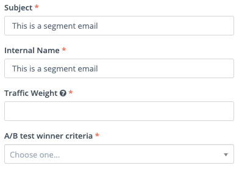
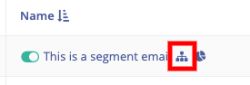

## A/B testing for Emails

A/B testing is available for Segment emails only.

### Create the parent
Before you can create an A/B test, you’ll first need to create the parent (A) email as you would create any normal email. Then, once you have saved this base email, you will find the A/B testing section in the general options to the right.

### Create the variant

Selecting the Add A/B test option above will open a new email window with one difference - you'll see some new options on the right hand side which relate to the A/B test.

There are some basic settings you will need to configure for your A/B test.

**Subject** The subject line for your email

**Internal Name** The internal name for your email (not shown to the customer, used for internal organisation)

**Traffic Weight:** This is the percentage of the total audience you’d like to receive this variant of the email. For example, if your total audience for this email is 50,000 contacts 20 in this box, Mautic will initially send an email to 10,000 contacts (20% of your total audience). You’ll determine the percentage to receive each variant when you create the variants.

**A/B test winner criteria:** This is the metric you’d like to use to determine the winner of your A/B test.  You can choose from:
* Asset download rate
* Email read rate
* Email clickthrough rate
* Form submission rate

### Create additional variants

With A/B testing it's important to only change one thing at a time, otherwise it's difficult to prove with statistical significance that the change you made resulted in the differences you see in the results.  Variants allow you to experiment with changing different parts of your email and make a decision based on the outcomes.

Make any edits you’d like to the email – whatever changes you’d like to test for performance.

> While you can create as many variants as you’d like, keep in mind that sum of the traffic weights across all variants must be equal to or less than 100%. To split the variants evenly, you’ll also want to leave a percentage for sending the parent. Mautic will send the parent to any percentage remaining after the percentage for all variants has been added.

### Working with variants
Variant emails won’t appear in your emails list. You’ll only see the parent email, with an icon indicating that the email has variants.

#### Emails With Variants

The icon in the list of emails which looks like an organizational chart indicates that the email has A/B variants.

Once you click into the parent email, scroll all the way to the bottom and select the Variants tab, next to Click Counts and Contacts.

> Be sure to publish the variants by toggling the red switch to green. If you leave them unpublished, which is how Mautic creates variants by default, that expected traffic will receive the parent email. 

To the right, you’ll see the percentage of traffic weight that will be included in the A/B test (in this example we are using 50%). You’ll also see the winner criteria listed (in this example we are using Read rate)

Once an A/B test has begun, you’ll see a trophy icon next to the variant that’s in the lead. 

To end the A/B test early and declare a winner to be sent out to the remaining audience, click the trophy. Once a winner is set, that winner will become the parent and other variants will be unpublished.

You will see a warning to confirm you wish to select the winner.

>The Current label shows the email you’re currently viewing, not the variant that is currently winning.

The A/B test stats button allows you to view the statistics based on what you set as the winning criteria.  In the case below, Email read rate was used.

## Mautic Minute: A/B Testing

The video below is a very quick one-minute overview of A/B testing.

[plugin:youtube](https://www.youtube.com/watch?v=KjBf5nqY_gY)

